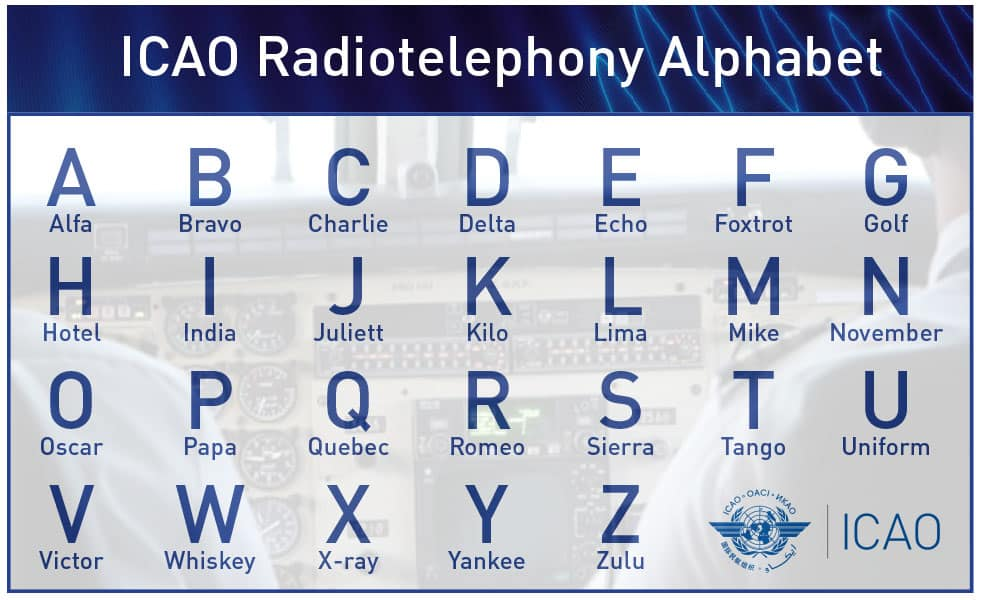

ICAO字母表是国际航空组织为了防止语音通话中听错（B/D， C/E这样的字母），特意为每个字母找一个常见单词来表示。
比如，我说Bravo，那对方不大可能会听错为字母D；我说Delta（或Dog），对方也不大可能误认为我在说字母B。

同样，对于IT行业中，当需要通过语音对话告知对方用户名、密码或者让对方运行某个命令等情况时，也可能需要用到
这个字母表。

|字母|对应单词|字母|对应单词|字母|对应单词|字母|对应单词|
|---|---|---|---|---|---|---|---|
A | Alpha | H | Hotel | O | Oscar | V | Victor |
B | Bravo | I | India | P | Papa | W | Whiskey |
C | Charlie | J | Juliet | Q | Quebec | X | X-ray |
D | Delta | K | Kilo | R | Romeo | Y | Yankee |
E | Echo | L | Lima | S | Sierra | Z | Zulu |
F | Foxtrot | M | Mike | T | Tango |  |  |
G | Golf | N | November | U | Uniform |  |  |

同样ICAO也有关于数字发音的规范或者建议：

Phonetic Numbers
|数字|读音|数字|读音|
|---|---||---|---|
|1 | WUN    |6 | SIX     |
|2 | TOO    |7 | SEV-en  |
|3 | TREE   |8 | AIT     |
|4 | FOW-er |9 | NIN-er  |
|5 | FIFE   |0 | ZEE-RO  |

对于运维运维人员来说，出了ICAO字母数字之外，还有特殊字符或者说标点符号。
密码中或者命令里，URL里也可能会出现任意特殊字符。也需要我们有所了解。

| 字符| 英文名|中文名称| 字符| 英文名 |中文名称|
|---|---|---|---|---|---|
|  | Space||                  | /| Slash||
| !| Exclamation||            | :| Colon||
| ”| Double quote||           | ;| Semicolon||
| #| Number sign (hash)||     | <| Less than||
| $| Dollar sign||            | =| Equal sign||
| %| Percent||                | >| Greater| than||
| &| Ampersand||              | ?| Question| mark||
| ’| Single quote||           | @| At sign||
| (| Left  parenthesis||      | [| Left bracket||
| )| Right  parenthesis||     | \| Backslash||
| *| Asterisk||               | ]| Right bracket||
| +| Plus||                   | ^| Caret||
| ,| Comma||                  | _| Underscore||
| -| Minus||                  | `| Grave accent (backtick)||
| .| Full stop||             |\|| Vertical bar||
| }| Right  brace||           | {| Left  brace||                   
| ~| Tilde||                             
                             

